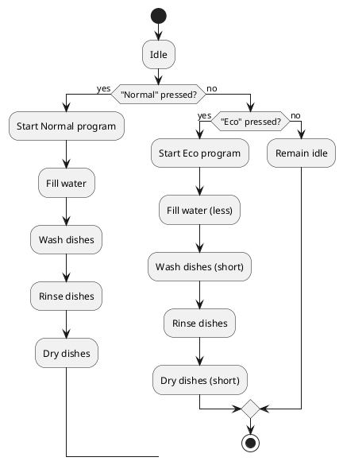

# Chapter 1

Some text here

```plantuml
@startuml Dishwasher

start
:Idle;

if ("Normal" pressed?) then (yes)
  :Start Normal program;
  :Fill water;
  :Wash dishes;
  :Rinse dishes;
  :Dry dishes;
else (no)
if ("Eco" pressed?) then (yes)
  :Start Eco program;
  :Fill water (less);
  :Wash dishes (short);
  :Rinse dishes;
  :Dry dishes (short);
else (no)
  :Remain idle;
endif

stop

@enduml
```

Some more text.