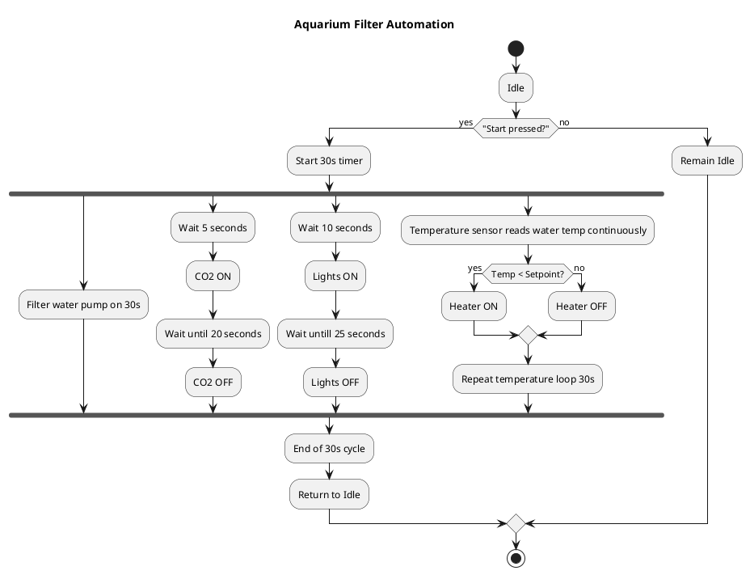

# 1. Proces Flowchart

The Twincat plc bakcup is in a seperate repository:

https://github.com/Doravandebuurt/personalassignmentPLC

The proces that my virtual PLC program describes, is the automation of handeling of water in an aquarium. the Flowchart of the process can be find below.

