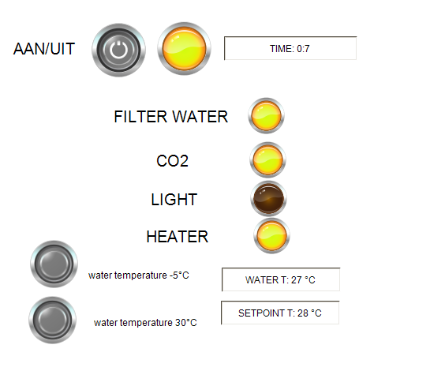
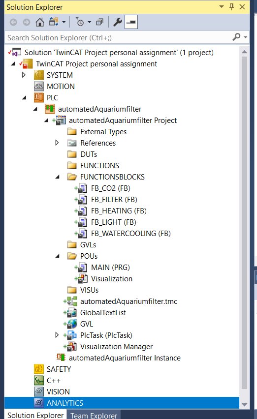
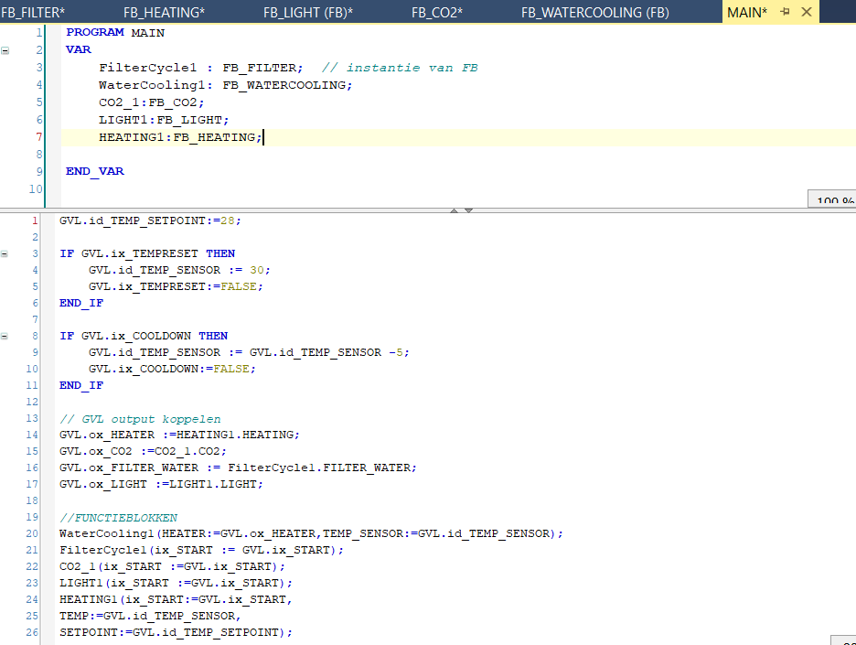

# 2. PLC PROGRAM

This is what the PLC visualisation looks like. lamps are used to indicate when a sertain function is executed. There are three buttons.

- "On/Off" button to start or stop the process
- "decrease temp -5 degrees" button to cool the water down by 5 degrees. the water cant get cooler than 15 degrees and it cant get warmer above the setpoint
-"reset water to 30 degrees" button, to set the water temperature to 30 degrees.

Here you see the content of program, there are 5 functionblocks that will be explained further on.

The program models the filtering, heating and co2 insertion of an automated aquarium filter. the cycletime of 1 process is 30 seconds (normally this would be in the range of hours, but for this model a shorter time was used)

Below is a screenshot of the main program.

