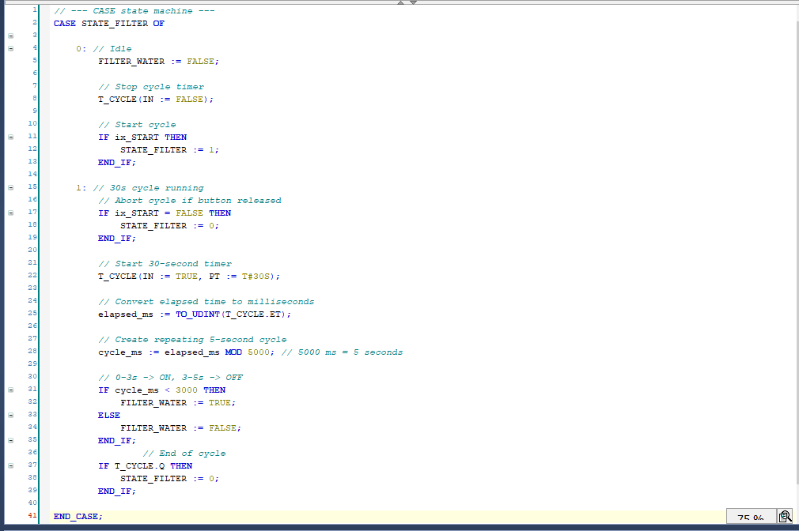
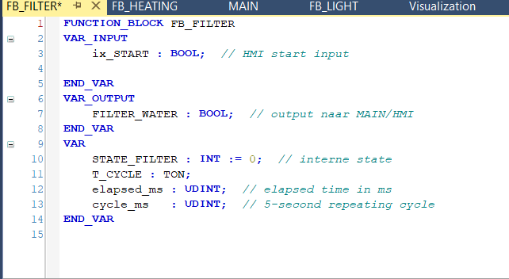
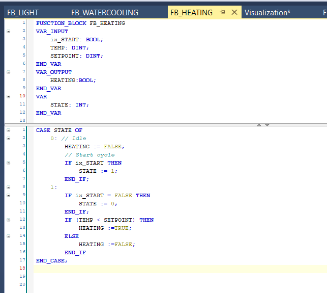

# FUNCTIONBLOCK C02

This functionblock regulates the co2 inserted in the aquarium. the co2 insertion starts always 5 seconds before the light goes on and ends 5 seconds before the lights goes off again.

# FUNCTIONBLOCK filter

This functionblock filters the water for 30 seconds by pumping/filtering for 3 seconds, then stopping for 2 seconds.

# FUNCTIONBLOCK heating

This functionblock heats the water when it is below the setpoint by 1 degree per second. 

# FUNCTIONBLOCK light

This functionblock turns the lights on and off for 20 seconds every cycle. 

# FUNCTIONBLOCK cooling

This functionblock simulates the water cooling down 1 degree every two seconds. with a limit of 15 degrees at its lowest.

