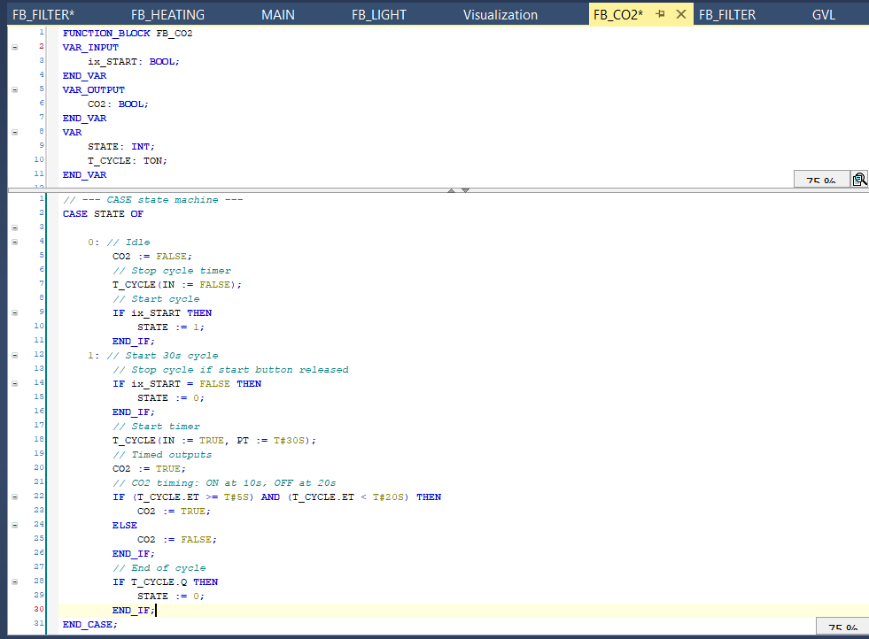

# FUNCTIONBLOK C02

This functionblock regulates the co2 inserted in the aquarium. the co2 insertion starts always 5 seconds before the light goes on and ends 5 seconds before the lights goes off again.

