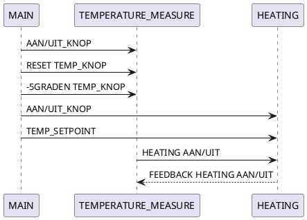

# 1. Machine SEQ diagram

@startuml machine sequence diagram

OFF -> ON : ON BUTTON
ON--> OFF : OFF BUTTON & RESET TIMER

ON -> "1" : CO2 OFF (t#5s)
"1" --> OFF : OFF BUTTON & RESET TIMER
ON -> "2" : LIGHT OFF (t#10s)
"2"-->OFF: OFF BUTTON & RESET TIMER
"1" -> "3" : CO2 ON (t#15s)
"3"-->OFF: OFF BUTTON & RESET TIMER
"2"->"4":LIGHT ON (t#15s)
"4"-->OFF: OFF BUTTON & RESET TIMER
"3" -> DONE : CO2 OFF (t#10s)
"4" -> DONE : LIGHT OFF (t#5s)
ON -> DONE : MONITOR WATER TEMPERATURE (t#30s)
ON -> DONE : FILTER WATER (t#30s)
DONE --> ON : RESET TIMER
DONE --> OFF : OFF BUTTON & RESET TIMER

@enduml

